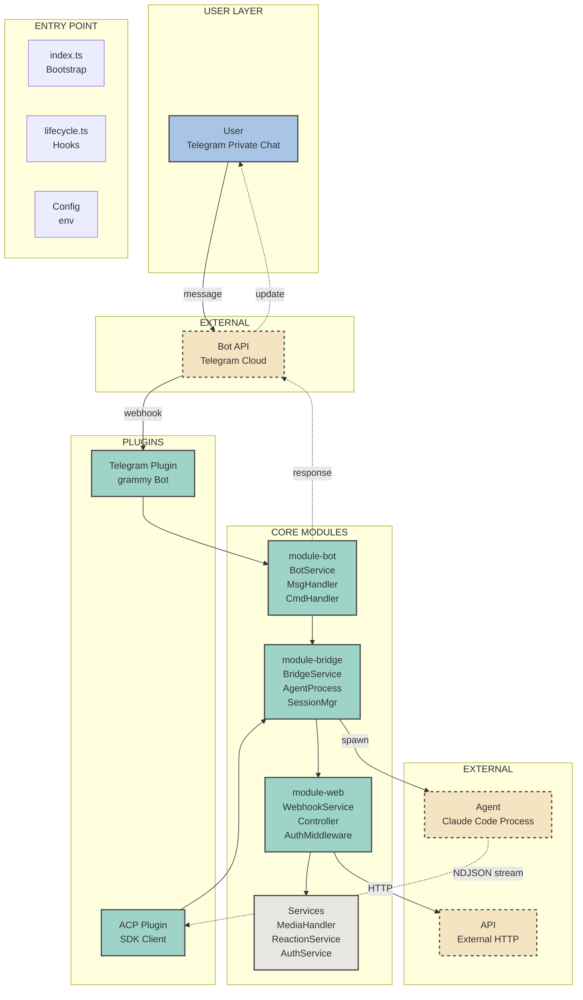
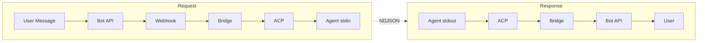

# Telegram Agent Architecture

## Architecture Layers

| Layer | Components | Purpose |
|-------|------------|---------|
| USER | User | Telegram private chat interaction |
| EXTERNAL | Bot API, Agent, API | External services and spawned processes |
| ENTRY | index.ts, lifecycle.ts, Config | Application bootstrap and configuration |
| PLUGINS | Telegram, ACP | Protocol clients and SDK integrations |
| CORE | module-bot, module-bridge, module-web, Services | Business logic and service orchestration |

## Module Details

### module-bot
- `BotService` - Grammy bot instance management
- `MessageHandler` - User message processing
- `CommandHandler` - Bot command routing (/start, /help, /status)
- `AuthService` - User authorization validation

### module-bridge
- `BridgeService` - Session and connection orchestration
- `AgentProcessService` - Spawn and manage Agent child process
- `SessionManager` - User session state management

### module-web
- `WebhookService` - HTTP API for external integrations
- `Controller` - Request routing
- `AuthMiddleware` - API authentication

### Services
- `MediaHandler` - Photo/audio download and upload
- `ReactionService` - Telegram message reactions
- `AuthService` - Authorization checks

## Data Flow

## Technology Stack

| Component | Technology |
|-----------|------------|
| Framework | ArtusX |
| Bot Client | Grammy |
| Agent Protocol | ACP SDK |
| Agent | Claude Code CLI |
| Language | TypeScript |