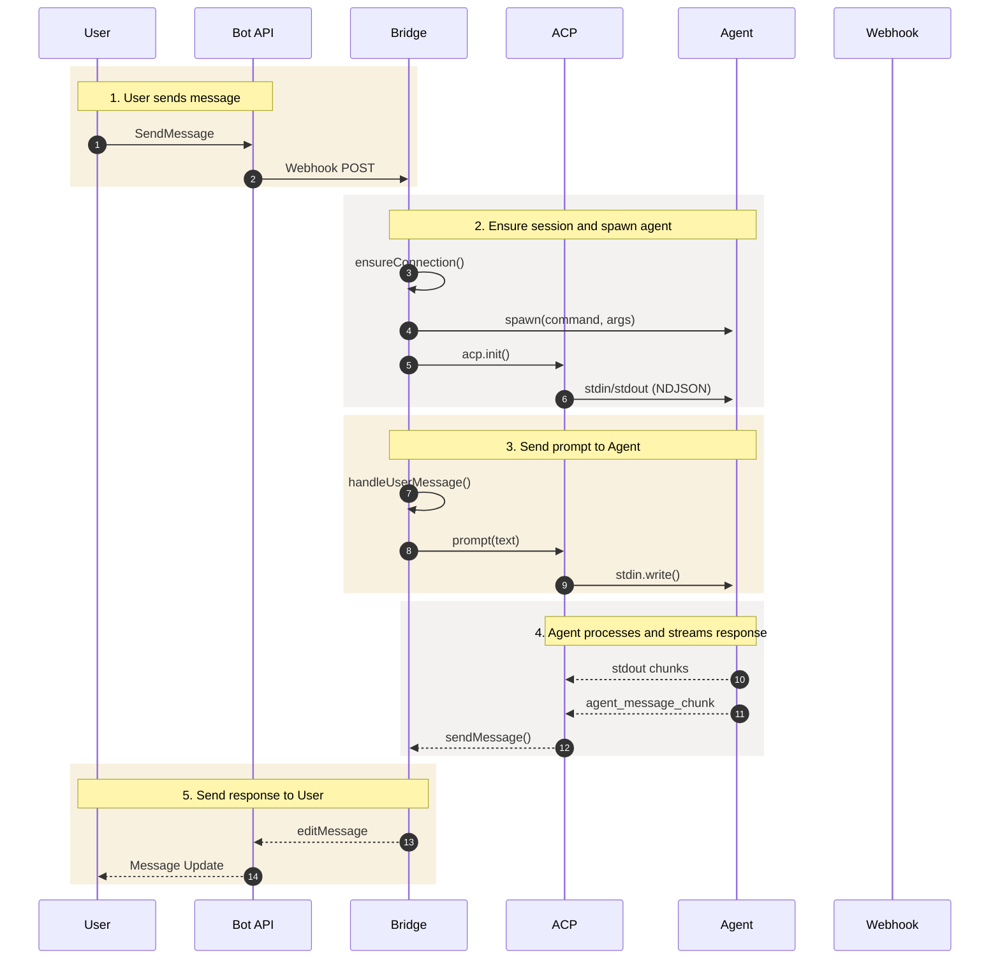

# Telegram Agent Message Flow

## Flow Description

| Step | Description |
|------|-------------|
| 1 | User sends message to Telegram Bot API via private chat |
| 2 | BridgeService ensures session exists and spawns Agent process |
| 3 | Prompt is sent to Agent through ACP stdin |
| 4 | Agent processes and streams response chunks via stdout |
| 5 | Response is sent back to User via Bot API |

## Components

| Actor | Module | Description |
|-------|--------|-------------|
| User | - | Telegram private chat user |
| Bot API | External | Telegram Cloud service |
| Bridge | module-bridge | Session management, connection orchestration |
| ACP | plugins/acp | Agent Client Protocol SDK |
| Agent | External | Claude Code spawned process |
| Webhook | module-web | HTTP endpoint for external API |